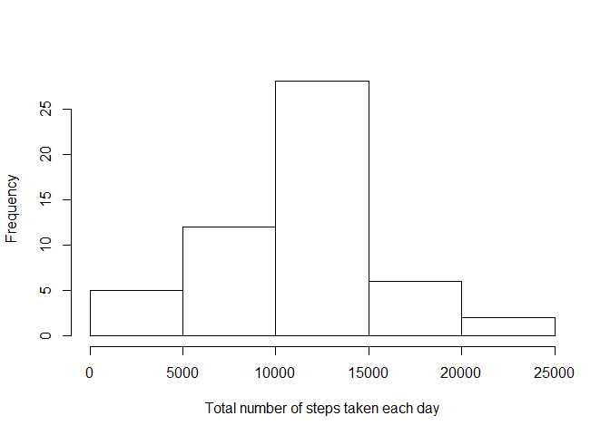

# Reproducible Research: Peer Assessment 1

## Loading and preprocessing the data

### Read data (assume file located at working directory)

```r
data <- read.csv(unz("activity.zip", "activity.csv"))
```
## What is mean total number of steps taken per day?

### Calculate the total number of steps taken per day

```r
d<-aggregate(steps ~ date, data, sum)
```
###  Make a histogram of the total number of steps taken each day

```r
hist(d$steps,xlab="Total number of steps taken each day", main="")
```

 

### Calculate the mean and median of the total number of steps taken per day

```r
mean(d$steps)
```

```
## [1] 10766.19
```

```r
median(d$steps)
```

```
## [1] 10765
```

## What is the average daily activity pattern?
### Calculate average number of steps taken per interval

```r
pattern<-aggregate(steps ~ interval, data, mean)
```
### Make a time series plot

```r
plot(pattern$interval,pattern$steps,type="l",ylab="Average number of steps",xlab="5-minute interval")
```

 

### Which 5-minute interval, on average across all the days in the dataset, contains the maximum number of steps

```r
pattern[pattern$steps==max(pattern$steps),"interval"]
```

```
## [1] 835
```
## Imputing missing values
### Calculate the total number of missing values in the dataset 

```r
nrow(data[is.na(data$steps),])
```

```
## [1] 2304
```
### Strategy for filling in all of the missing values in the dataset - set to mean for all day

```r
data_noNA<-data
data_noNA[is.na(data_noNA$steps),"steps"]<-mean(d$steps)
mean(d$steps)
```

```
## [1] 10766.19
```

```r
median(d$steps)
```

```
## [1] 10765
```

## Are there differences in activity patterns between weekdays and weekends?
